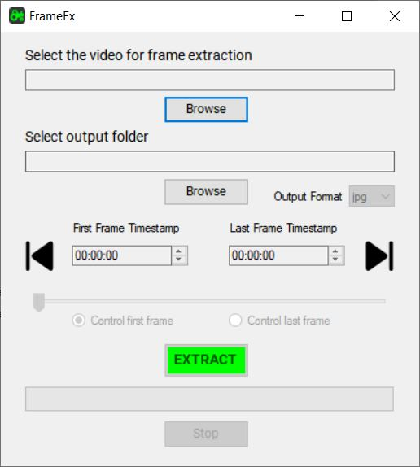

# FrameEx
- Extract frames from a video or only a part of it
- Supports mp4, m4v, mov, avi, mkv, wmv videos
- Release contains FFMPEG that is needed for app to work

## Steps:
1) Select the video you want to extract frames from
2) Select the output folder for the frames
3) Select the output format for frames (Optional)
4) Select timestamps of the first and the last frame of a sequence you want the frames extracted for (Optional)
5) EXTRACT
##

# For developers:
- The app is essentially a wrapper for calling frame extraction with FFmpeg.exe. Therefore you need the FFmpeg.exe in the same folder with FrameEx.exe.
- Don't forget to add FFmpeg inside debug folder for testing. If you build your own app, you can change variable 'ffmpegPath' in code as it suits you.
- Restore NuGet packages
- App target framework .NET Framework 4.5.2
- GUI created using WinForms
- Code is not clean and can be optimised a bit but it works fine and the app is fast.

## License
 
The MIT License (MIT)

Copyright (c) 2023 github.com/jasezovemcar

Permission is hereby granted, free of charge, to any person obtaining a copy of this software and associated documentation files (the “Software”), to deal in the Software without restriction, including without limitation the rights to use, copy, modify, merge, publish, distribute, sublicense, and/or sell copies of the Software, and to permit persons to whom the Software is furnished to do so, subject to the following conditions:

The above copyright notice and this permission notice shall be included in all copies or substantial portions of the Software.

THE SOFTWARE IS PROVIDED “AS IS”, WITHOUT WARRANTY OF ANY KIND, EXPRESS OR IMPLIED, INCLUDING BUT NOT LIMITED TO THE WARRANTIES OF MERCHANTABILITY, FITNESS FOR A PARTICULAR PURPOSE AND NONINFRINGEMENT. IN NO EVENT SHALL THE AUTHORS OR COPYRIGHT HOLDERS BE LIABLE FOR ANY CLAIM, DAMAGES OR OTHER LIABILITY, WHETHER IN AN ACTION OF CONTRACT, TORT OR OTHERWISE, ARISING FROM, OUT OF OR IN CONNECTION WITH THE SOFTWARE OR THE USE OR OTHER DEALINGS IN THE SOFTWARE.
